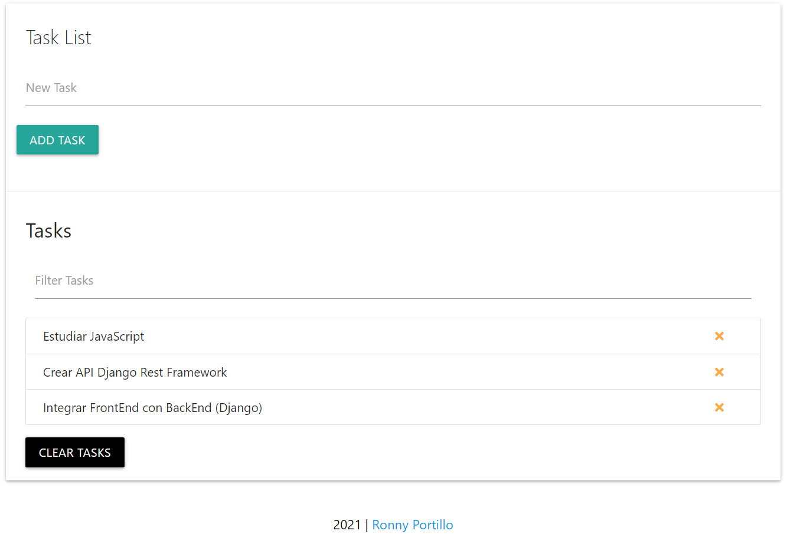

# Hi, I'm Ronny! 👋

## 👨🏾‍💻 About Me

I'm Python and JavaScript Developer... Although my native programming language is Python 🐍.

## 🛠 Skills

Python, Javascript, HTML, CSS, Git, Unit Testing, Asynchronous programming, Django, API RESTFul, Django Rest FrameWork, Machine learning, Deep Learning, etc.

# Project

# Task List | JavaScript

This project has been created by **Ronny Portillo** in order to have a task list.

To test the project please go to the following link: <a href="https://portilloronny6.github.io/tasklist-js/" target="_blank">Project</a>

## Tech using in this project

**Language:** HTML, CSS, JavaScript

**Server:** Github

## Support

For support, email portilloronny6@gmail.com or visit <a href="https://portilloronny6.github.io/website/" target="_blank">my personal website</a>.
